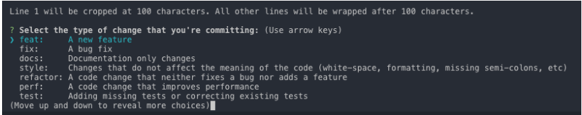

## VScode格式化css、JS等
在项目的根目录下新增.jsbeautifyrc文件，里面的代码如下：
```
{
    "brace_style": "none,preserve-inline",
    "indent_size": 2,
    "indent_char": " ",
    "jslint_happy": true,
    "unformatted": [""],
    "css": {
      "indent_size": 2
    }
}
```
修改VScode的配置json文件，在里面增加
```
{
    "editor.formatOnSave": true
}
```
后面保存css时，自动格式化文件

## setTimeout
DOM操作会引起浏览器的回流(reflow)，如果浏览器的reflow执行时间远大于代码执行时间，会造成代码执行完成之后，浏览器仍然在卡顿中。统计代码结束的时间，应放在`setTimeout`的`callback`中，其`callback`会被推迟到浏览器主线程reflow结束之后才执行。
```
const createElements = count => {
  const start = new Date();
  for (let i = 0; i < count; i++) {
    const element = document.createElement('div');
    element.appendChild(document.createTextNode('' + i));
    document.body.appendChild(element);
  }
  setTimeout(function () {
    console.log('渲染耗时：',new Date() - start);
  }, 0);
};
document.querySelector('#btn').addEventListener('click', e => createElements(10000))
```

## 使用`Commitizen`代替 `git commit`
可以使用[cz-cli](https://github.com/commitizen/cz-cli)工具代替 git commit

全局安装
```
npm install -g commitizen cz-conventional-changelog

npm install -g git-cz

echo '{ "path": "cz-conventional-changelog" }' > ~/.czrc
```
全局安装后使用 git cz 代替 git commit就可以了,如下图

