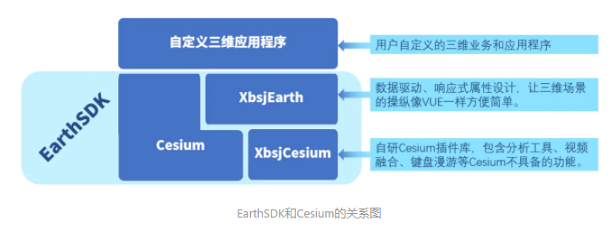
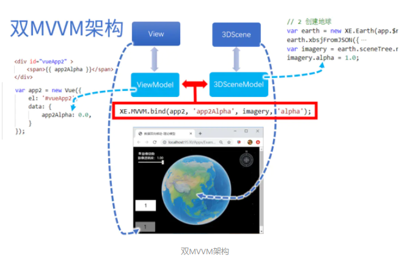

## EarthSDK和Cesium的关系
EarthSDK中主要包括XbsjEarth.js和XbsjCesium.js两个js包。

XbsjCesium.js用来扩展Cesium所不具备的三维可视化功能，例如视频融合、分析工具、模型压平等。

XbsjEarth.js则主要目标在于封装出更加易于使用的API接口，尽可能屏蔽掉前端开发工程师所不熟悉的图形学、GIS相关内容。会在Cesium的基础上封装好一些复杂的交互操作，并提供极其简单的API接口方便调用。

## 三维应用中使用MVVM
对于三维应用程序来说，其实也可以看成View和ViewModel两个部分。View是最终显示的三维窗口，而ViewModel则是对应的响应式属性。为了加以区分，这里把三维应用的View写成3DScene，ViewModel写成3DSceneModel。如下图所示

经过这样的改造以后，就可以通过简单的属性值设置，来修改三维窗口的样子了。比如执行imagery.alpha = 0.5这个语句，就会让地球上的影像变得很淡。另外一点imagery.alpha属性的变化，可以被外界感知。通过XE.MVVM.bind这个方法，将imagery.alpha和app2.app2Alpha绑定在一起，imagery.alpha的变化就会相应地影响app2.app2Alpha，进而让View也跟着一起变化。
