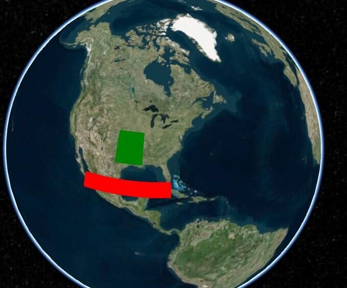

## Cesium 坐标系转换
 cesium中常用的坐标有两种WGS84地理坐标系和笛卡尔空间坐标系(世界坐标)。我们平时常用的以经纬度来指明一个地点就是用的WGS84坐标，笛卡尔空间坐标系常用来做一些空间位置变换如平移旋转缩放等等

#### 世界坐标转地理坐标

`var cartCoordinates = window._cesium.scene.globe.ellipsoid.cartesianToCartographic(
        cartesianCoordinates,
      )`
#### 地理坐标（弧度）转经纬度坐标
`const clickCoord = [
        Cesium.Math.toDegrees(cartCoordinates.longitude),
        Cesium.Math.toDegrees(cartCoordinates.latitude),
      ]`
## camera和globel中的pick
这两个里面的pick一般搭配使用，通过camera中的getPickRay获取ray（射线），然后通过globel中的pick方法，获取世界坐标

这个是常用的方法，当你想获取当前鼠标位置的三维坐标时，经常使用到这个方法：

第一步：通过camera的getPickRay，将当前的屏幕坐标转为ray（射线）；

`var windowPosition = window._cesium.camera.getPickRay(evt.data.position)`

第二步：找出ray和地形的交点，即可求出三维世界坐标

```
var cartesianCoordinates = window._cesium.scene.globe.pick(
    windowPosition,
    window._cesium.scene,
)
```

## PrimitiveCollection
```
var redRectangle = new Cesium.Primitive({
  geometryInstances: new Cesium.GeometryInstance({
      geometry: new Cesium.RectangleGeometry({
          rectangle: Cesium.Rectangle.fromDegrees(-110.0, 20.0, -80.0, 25.0)
      }),
      attributes: {
          color: Cesium.ColorGeometryInstanceAttribute.fromColor(Cesium.Color.RED)
      }
  }),
  appearance: new Cesium.PerInstanceColorAppearance({
      flat: true
  })
});
var greenRectangle = new Cesium.Primitive({
  geometryInstances: new Cesium.GeometryInstance({
      geometry: new Cesium.RectangleGeometry({
          rectangle: Cesium.Rectangle.fromDegrees(-100.0, 30.0, -90.0, 40.0),
      }),
      attributes: {
          color: Cesium.ColorGeometryInstanceAttribute.fromColor(Cesium.Color.GREEN)
      }
  }),
  appearance: new Cesium.PerInstanceColorAppearance({
      flat: true
  })
});
var rectangleCollection = new Cesium.PrimitiveCollection();
rectangleCollection.add(redRectangle);
rectangleCollection.add(greenRectangle);
viewer.scene.primitives.add(rectangleCollection);
```
代码运行完后的效果图如下所示：

