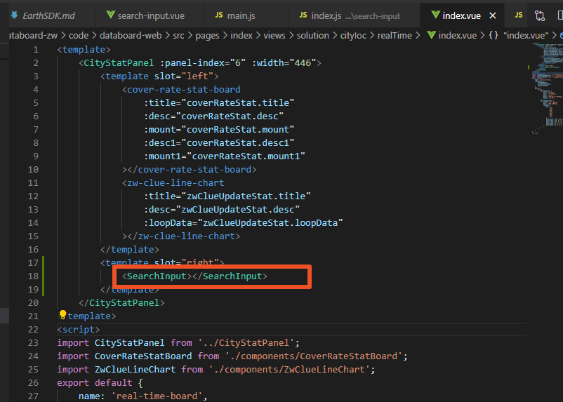

## 本地编写npm包
编写顺丰公司下的内部npm包，整个框架初步结构如下图所示：


图片右侧红框内的代码之所以注释，原因如下图所示：


在webpack打包的时候，可以在js文件中混用require和export。但是不能混用import 以及module.exports。

因为webpack 2中不允许混用import和module.exports

故本地编写npm包，推荐使用export default，等到发布包的时候再将其改用成上面的代码。

### 项目内如何引用该npm包
在main.js中，加入以下代码即可：
```
import SFView from '@/sf-view-vue/src';

Vue.use(SFView);
```
在其他页面组件内，即可引用该包下面的`search-input`组件，如下图所示：



## npm仓库地址
公司默认使用的是淘宝的[npm](https://registry.npm.taobao.org/)库，可通过`npm config get registry`查看设置过的所有源

公司内部私有npm包

## 规划

1. 需继续融合测量工具等一系列常用组件；
2. 目前组件工具包，样式暂时用的是css，随着组件项目的扩大，需转成less或sass，视小组成员对css预处理语言的熟悉度而定；
3. 后期需新建types文件夹，与src同级，增加对所有组件的d.ts定义；
4. 需根据不同的项目系统，设置不同theme主题的组件库，目前我所知道的项目有警务、政务及武汉智慧城市；
5. 封装好的组件可能内部有部分功能在某个项目中是不需要的，但在另一些项目中又是需要的，可根据参数配置灵活显示/隐藏这些功能；
6. 最好统一代码风格，推荐引入prettier.js；
7. 因组件内容较多，需引入单元测试；
8. 根据npm提供的钩子，做一些pre或post工作

## 搜索组件接口功能介绍
### 地图接口

`globalConfig.server.mapServer`为地图接口地址的统一前缀名，一般为ip地址加端口号


1. 定位到具体的小区  `sf3d_wh/area/info?area_id=&adcode=`
2. 城市加载完成，调用query接口，post请求
```
$axios
.post(globalConfig.server.mapServer + 'sf3d_wh/general/query', params, {
    headers: {
        'Content-Type': 'application/x-www-form-urlencoded',
    },
})
```
其入参为

```
const params = new FormData()
params.append(
    'sql',
    'select adcode,aoi_id ,aoi_name ,height,st_astext(geom) as geom from aoi_info' +
        city.code +
        " where  adcode in ('420106')",
)
```
### Sf3d sdk2.0
使用该sdk之前，必须先实例化`Sf3d.Aois`
```
const Sf3d = window.Sf3d;
window._aois = new Sf3d.Aois(`${globalConfig.server.mapServer}sf3d_wh`,{});
```

若有aoid信息，则可定位到具体小区，并将其高亮
```
flyToArea(aoiId) {
    const aois = window._aois;
    aois.loadCityAois(this.adcode).then(() => {         
        aois.aoi.loadAoi(this.adcode, aoiId, Config.sceneType).then(() => {
            var collection = Sf3d.Util.GeoJson2Point3dCollection(aois.aoi.curAoiData)[0];
            var sphere = collection.exportBoundingSphere();
            var sf3d = globalData.map
            sphere.radius *= 1.5;
            sf3d.camera.focusOnSphere({
                boundingSphere: sphere,
                pitch: -35
            })
            this.flattenTiles();
        })
    })
}

// 压平白膜
flattenTiles() {
    var instance = window._layers && window._layers['baiMo'] || null;
    var pointCollection = Sf3d.Util.GeoJson2Point3dCollection(window._aois.aoi.curAoiData);
    var flattenPlane = new Sf3d.FlattenPolygon({
        traces: pointCollection,
        showHelper: false,
        target:instance
    });
}
```
若无aoid信息，则可根据经纬度定位到小区
```
// 飞到无aoi信息，只有经纬度的小区
flyToEmptyArea(position) {
    var sf3d = globalData.map;
    if (position && position.length > 1) {
        var points = new Sf3d.Point3d().fromLngLat(position[0], position[1])
        sf3d.camera.focusOnPoint({
            position: points,
            pitch: -35,
            duration: 3
        })
    }
    
}
```
点击搜索组件左侧楼栋区域，相应楼栋高亮
```
// 飞到楼栋
flyToBuilding(buildid) {
    const aoi = window._aois.aoi;
    aoi.focusOnBuilding(buildid);
    aoi.unHighlightBuilding();
    aoi.highlightBuilding(buildid);
},
```

点击地图上某一栋户室，需先点击该楼栋的标牌，使其分裂，才可点击选取相应的户室，该方法内嵌在sdk2.0里。此时，需要注意侦听选取户室事件，将左侧搜索区域的对应户室高亮
```
methods: {
    addEvent() {
        const aoi = window._aois.aoi;
        aoi.aoiBuilding.on('onHouseOrFloorClick', this.handleHouseOrFloorClick);
    },
    handleHouseOrFloorClick(event) {
        const { houseId } = event.data
        this.$store.commit('SET_SELECT_ROOM', {
            id: houseId,
            mapClick: true
        })
    },
    unbindEvent() {
        const aoi = window._aois.aoi;
        aoi.aoiBuilding.off('onHouseOrFloorClick', this.handleHouseOrFloorClick);
    }
},
mounted() {
    this.addEvent()
},
destroyed() {
    this.unbindEvent()
}
```


