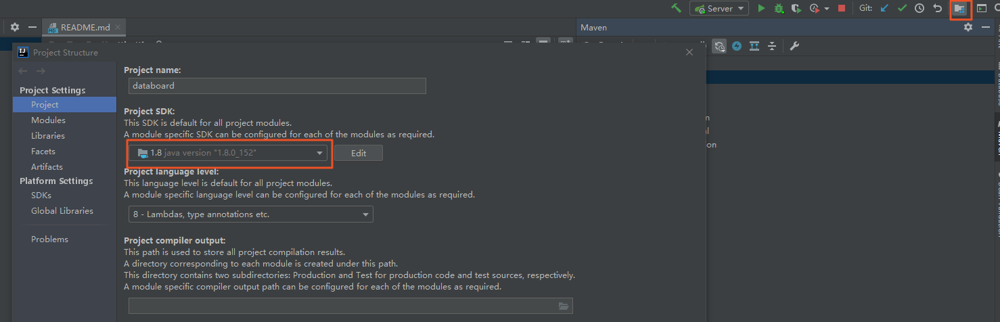
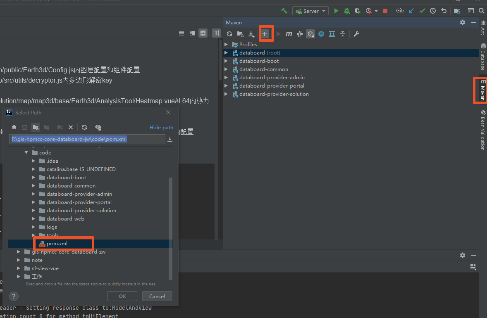
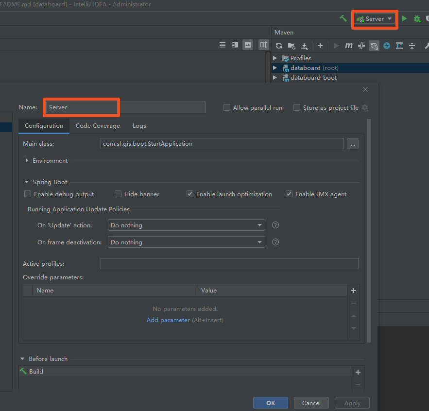

## 需要安装ideaUI
软件地址：\\10.82.250.88\share\5.tools\ProgramSoft\JavaSoft\ide
软件安装完成后，别急着打开，需再加载一个激活包，地址：http://10.82.248.60:10080/ide-eval-resetter-2.1.6.zip

## Idea启动java项目
第一步，点击右上角红框按钮，确定已选择jdk，如下图所示

第二步，点击右侧maven，查看项目是否在目录下，若没有，点击上面的`+`按钮，出现左侧弹层，确定选择pom.xml即可

第三步，运行项目，点击`Server`按钮下的`Edit Configurations`，输入项目名称，点击确定即可运行
