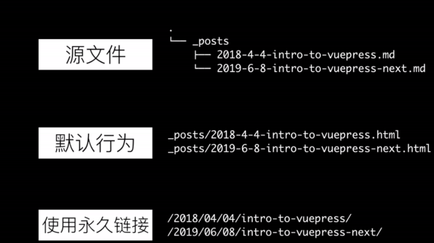
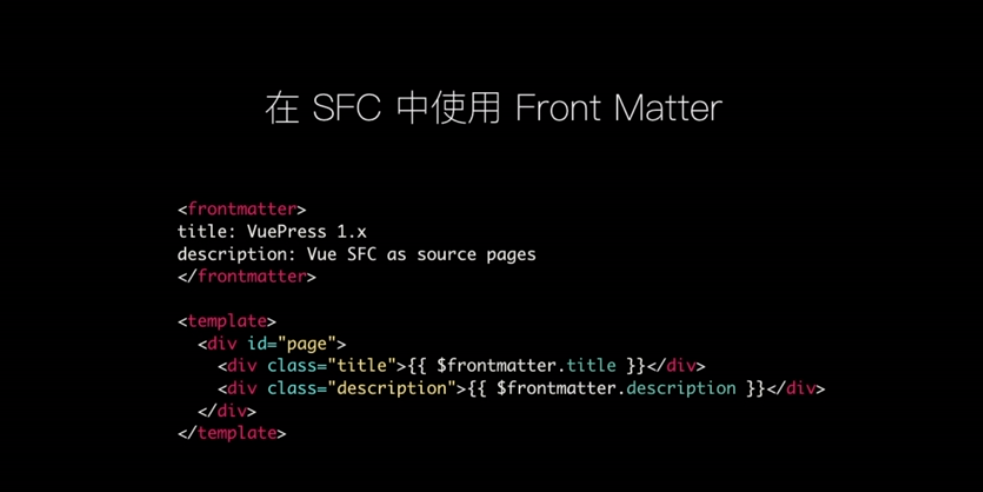
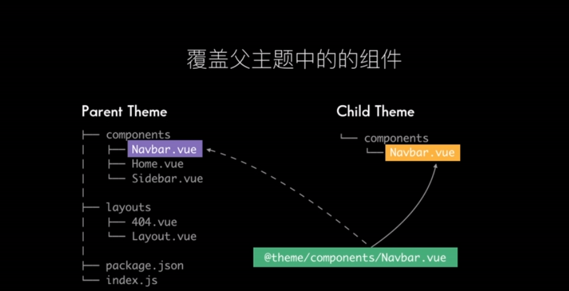

# 文档系统
vuepress algolia搜索

@vuepress/plugin-blog 
- 自定义基于目录（_post）或者Front Matter（如tag）的分类
- 内置博客风格的Permalinks
- 开箱即用的分页功能

## 插件案例
实现一个Vuepress插件，包含如下功能：
1. 添加一个额外的页面/info/:
2. 在/info/页展示出当前站点下所有的页面信息：
3. 新增页面信息"字数":
4. 注册`vuepress view-info`指令，实现上述相同的功能
```
const { join } = require('path');

module.exports = (options, context) => ({
    additionalPages() {
        return {
            path: '/info/',
            // 在SFC(Single File Component)中通过this.$site.pages拿到所有页面
            filePath: join(__dirname, 'info.vue')
        }
    },
    extendPageData($page) {
        const { _content } = $page;
        $page.charsCount = _content.length
    },
    extendCli(cli) {
        cli
            .command('view-info [targetDir]', '')
            .action(async (dir = '.') => {
                // 通过ctx.pages拿到所有的页面
            })
    }
})
```
5. 永久链接 permalinks

6. 在SFC中使用Front Matter

7. 覆盖父主题中的组件


