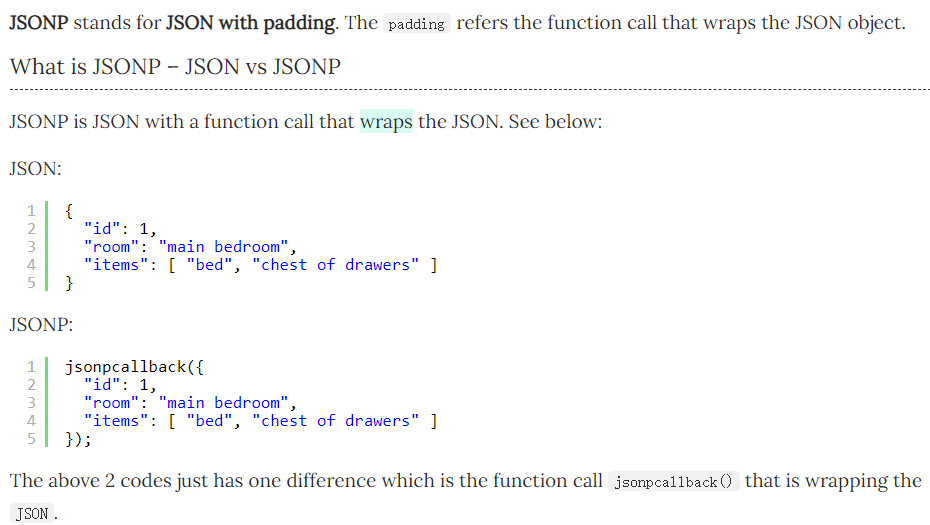
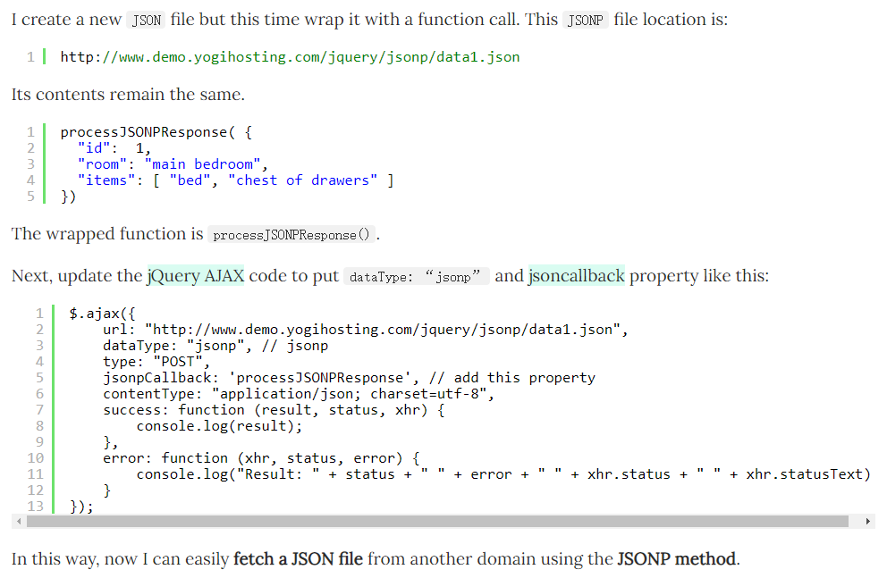
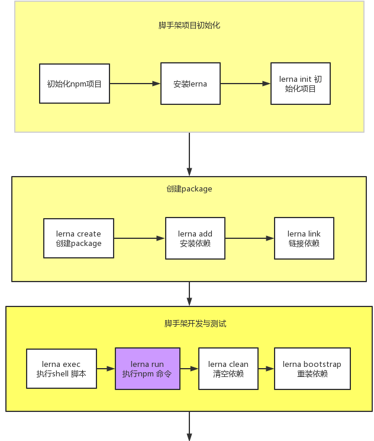
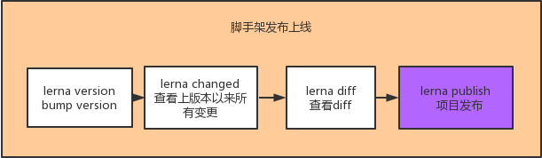

## Axois
### 默认 HTTP 适配器
Axios 同时支持浏览器和 Node.js 环境，对于浏览器环境来说，我们可以通过 XMLHttpRequest 或 fetch API 来发送 HTTP 请求，而对于 Node.js 环境来说，我们可以通过 Node.js 内置的 http 或 https 模块来发送 HTTP 请求。

为了支持不同的环境，Axios 引入了适配器。在 HTTP 拦截器设计部分，我们看到了一个 dispatchRequest 方法，该方法用于发送 HTTP 请求

## 16ms优化
- 大多数设备的刷新频率是 60 次/秒，（1000/60 = 16.6ms）也就说是浏览器对每一帧画面的渲染工作要在 16ms 内完成，超出这个时间，页面的渲染就会出现卡顿现象，影响用户体验。
- 浏览器在一帧里面，会依次执行以上这些动作。减少或者避免 layout，paint 可以让页面不卡顿，动画效果更加流畅。

## Immutable
为了避免 deepCopy 把所有节点都复制一遍带来的性能损耗，Immutable 使用了 Structural Sharing（结构共享），就是对于本次操作没有修改的部分，我们可以直接把相应的旧的节点拷贝过去，这其实就是结构共享。

## JSONP
JSONP is JSON with a function call that wraps the JSON. See below:



## 语义化版本2.0.0（Semantic Versioning）
[语义化版本2.0.0](https://semver.org/lang/zh-CN/)

在软件管理的领域里存在着被称作“依赖地狱”的死亡之谷，系统规模越大，加入的包越多，你就越有可能在未来的某一天发现自己已深陷绝望之中。

考虑使用这样的版本号格式：
X.Y.Z（主版本号.次版本号.修订号）
- 修复问题但不影响 API 时，递增修订号；
- API 保持向下兼容的新增及修改时，递增次版本号；
- 进行不向下兼容的修改时，递增主版本号。

## package.json里的resolutions详解
We have the following packages and their dependencies:
```
package-a@1.0.0
 |_ package-d1@1.0.0
     |_ package-d2@1.0.0

package-a@2.0.0
 |_ package-d1@2.0.0
     |_ package-d2@1.0.0

package-b@1.0.0
 |_ package-d1@2.0.0
     |_ package-d2@1.0.0

package-c@1.0.0
 |_ package-a@2.0.0
     |_ package-d1@2.0.0
         |_ package-d2@1.0.0
```

With:
```
"dependencies": {
    "package-a": "1.0.0",
    "package-b": "1.0.0"
  },
  "resolutions": {
    "**/package-d1": "2.0.0"
  }
```

yarn will use package-d1@2.0.0 for every nested dependency to package-d1 and will behave as expected with respect to the node_modules folder by not duplicating the package-d1 installation.

With:
```
 "dependencies": {
    "package-a": "1.0.0",
    "package-b": "1.0.0"
  },
  "resolutions": {
    "package-a/package-d1": "3.0.0"
  }
```

yarn will use package-d1@3.0.0 only for package-a and package-b will still have package-d1@2.0.0 in its own node_modules.

With:
```
"dependencies": {
    "package-a": "1.0.0",
    "package-c": "1.0.0"
  },
  "resolutions": {
    "**/package-a": "3.0.0"
  }
```

package-a will still be resolved to 1.0.0, but package-c will have package-a@3.0.0 in its own node_modules.


With:
```
"dependencies": {
    "package-a": "1.0.0",
    "package-c": "1.0.0"
  },
  "resolutions": {
    "package-a": "3.0.0"
  }
```
yarn will do nothing (see below why).


With:
```
"dependencies": {
    "package-a": "1.0.0",
    "package-c": "1.0.0"
  },
  "resolutions": {
    "**/package-a/package-d1": "3.0.0"
  }
```
yarn will use package-d1@3.0.0 both for package-a and the nested dependency package-a of package-c.

[原文链接地址](https://github.com/yarnpkg/rfcs/blob/master/implemented/0000-selective-versions-resolutions.md)

## npm包slash
作用：将Windows反斜杠路径转换为斜杠路径，如`foo\\bar` -> `foo/bar`
```
slash(process.cwd()).indexOf('/packages/test') > 0
```

## 前端脚手架包管理--lerna
### 原生脚手架开发痛点
1. 重复性操作
- 多package本地link
- 多package依赖安装
- 多package单元测试
- 多package代码提交
- 多package代码发布
2. 版本一致性
- 发布时版本一致性
- 发布后相互依赖版本升级

> package 越多管理难度越大

### 优点
- 大幅度减少重复
- 提升操作的标准化

> lerna是架构优化的产物，它揭示了一个架构的真理：项目复杂度提升后就需要对项目进行架构优化。架构优化的主要目标往往以效能为核心

### lerna 开发脚手架流程



## npx
npx是一个工具，npm v5.2.0引入的一条命令（npx），一个npm包执行器

主要特点：
1. 临时安装可执行依赖包，不用全局安装，不用担心长期的污染。
2. 可以执行依赖包中的命令，安装完成自动运行。
3. 自动加载node_modules中依赖包，不用指定$PATH。
4. 可以指定node版本、命令的版本，解决了不同项目使用不同版本的命令的问题。

以上就是npx与npm的区别。

### 全局命令，免安装
好处就是避免安装全局命令，以及对于命令开发者来说，可以减少碎片化问题。

```
$ npx @vue/cli -V

# 等价于

$ npm install @vue/cli -g
$ vue -V
```

### 本地 bin 寻址
我们知道，如果一个包配置了 `bin`后，当它被安装的时候，在项目的 <code>node_modules/.bin</code>下就会有相应的指令，方便执行。

如常见的执行单元测试，我们可以看到 mocha 有配置了一个[bin](https://github.com/mochajs/mocha/blob/master/package.json%23L490)

```
# 手动档执行
$ node node_modules/.bin/mocha **/*.test.js

# 改装党，配置 zsh 别名：alias n='PATH=$(npm bin):$PATH'
$ n mocha **/*/test.js
 
# 一劳永逸党，把 mocha 指令写入到 npm scripts 后，会自动寻址 node_modules/.bin
# { scripts: { "test": "mocha **/*.test.js" }}
$ npm test

# 顺手牵羊党，适用于临时需要执行某个 bin
$ npx mocha **/*.test.js
```